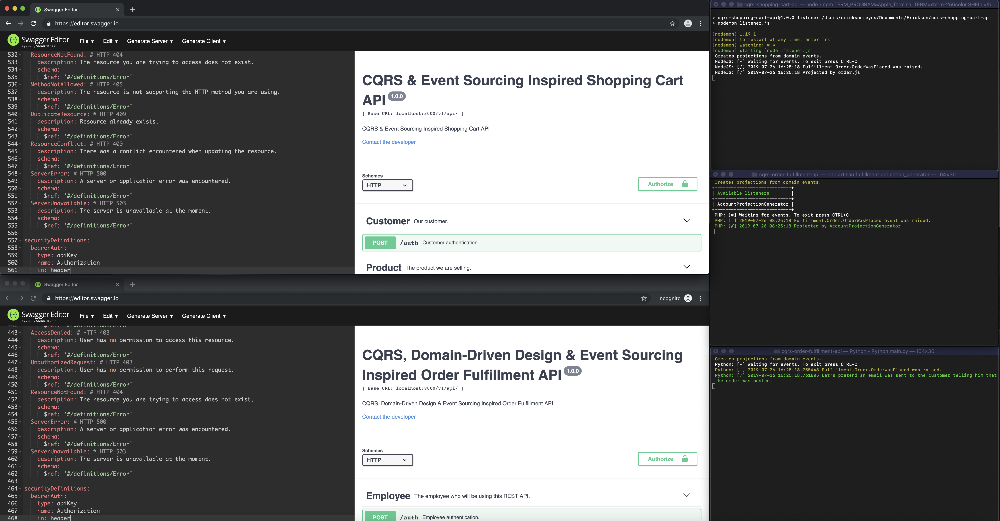

# CQRS, Domain-Driven Design &amp; Event Sourcing Inspired Order Fulfillment API

[](https://travis-ci.org/ericksonreyes/cqrs-order-fulfillment-api)
[](https://coveralls.io/github/ericksonreyes/cqrs-order-fulfillment-api?branch=master)
[](LICENSE.MD)

This will be the Order Fulfillment REST API that will handle the orders placed from the [Shopping Cart API](https://github.com/ericksonreyes/cqrs-shopping-cart-api).

## Description
Our goal is to show how CQRS and Event Sourcing works but with minimal configuration so instead of asking you
to install MySQL or MongoDB we will just use SQLite3 for data storage. The domain codes are unit tested and we are using 
[Hexagonal Architecture](https://fideloper.com/hexagonal-architecture). We also used [Symfony's Dependency Injection Component](https://symfony.com/doc/current/components/dependency_injection.html)
for easy configuration of parameters and service. 
 
This repository will play as your Order Fulfillment System (Or whatever it is called) REST API server.

Orders can be created via published Domain Events or via the create order API end point. Orders are manipulated via the 
projection generators. The state of the Orders are not saved, only the events relevant to it.


## Built With

* [PHP](https://www.php.net/)
* [Lumen Framework](https://lumen.laravel.com/)
* [RabbitMQ](https://www.rabbitmq.com/)
* [Python3](https://www.python.org/download/releases/3.0/)

## Requirements
* [Docker](https://www.docker.com/)

## Installation
* Run ```docker-compose build```
* Run ```docker-compose run --rm composer install```

## Starting the application
* Run ```docker-compose up server``` in a separate command line interface.
* Run ```docker-compose run --rm php artisan migrate:fresh --seed``` in a separate command line interface.
* Run ```docker-compose run --rm -T php artisan fulfillment:projection_generator``` in a separate command line interface to 
start the event listener that updates the projection tables.
* Run ```docker-compose run python main.py``` in a separate command line interface to start the mock e-mail sending event listener. 

## How to use
You can use the content of the [OpenAPI specification](./swagger.yml) of the REST API in the following:

* [Swagger Editor](https://editor.swagger.io)
* [Postman](https://www.getpostman.com)

Using Swagger as testing tool and when all listeners are running. Your screen may look like this:


The swagger.yml host is already http://localhost:8000 by default. So no need to configure much and just test the application.
Keep the application is using the default credentials of RabbitMQ (guest/guest) so no need to configure it too. Also keep the 
[Shopping Cart API](https://github.com/ericksonreyes/cqrs-shopping-cart-api) application up and running together with this application.

## Built With

* [PHP](https://www.php.net/)
* [Lumen Framework](https://lumen.laravel.com/)
* [RabbitMQ](https://www.rabbitmq.com/)

## Versioning

We use [SemVer](http://semver.org/) for versioning. For the versions available, see the [tags on this repository](https://github.com/ericksonreyes/cqrs-shopping-cart-api/tags). 

## Author

* **Erickson Reyes** - *Initial work* - [ericksonreyes](https://github.com/ericksonreyes)

## License

This project is licensed under the MIT License - see the [LICENSE.md](LICENSE.md) file for details
